# Exploratory Data Analysis Report
## Hybrid Explainable Transformer Framework for Detecting AI-Generated Academic Text Using Ensemble Learning

**Generated on:** 2026-07-10 14:08:45

---

## 1. Dataset Overview

### 1.1 Basic Information

- **Number of Rows:** 552,307
- **Number of Columns:** 3
- **Dataset Shape:** (552307, 3)
- **Memory Usage:** 1511.21 MB

### 1.2 Column Information

**Column Names:** text, label, source

**Data Types:**
- text: str
- label: int64
- source: str

### 1.3 Data Quality

**Missing Values:**
- text: 0
- label: 0
- source: 0

**Duplicate Values:** 0

---

## 2. Class Distribution

- **Human Written (0):** 317,755 samples (57.53%)
- **AI Generated (1):** 234,552 samples (42.47%)

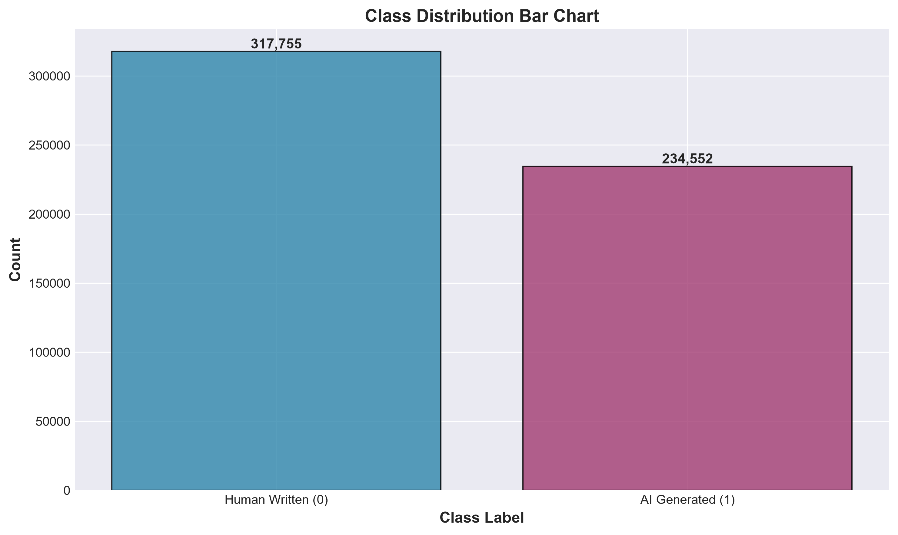

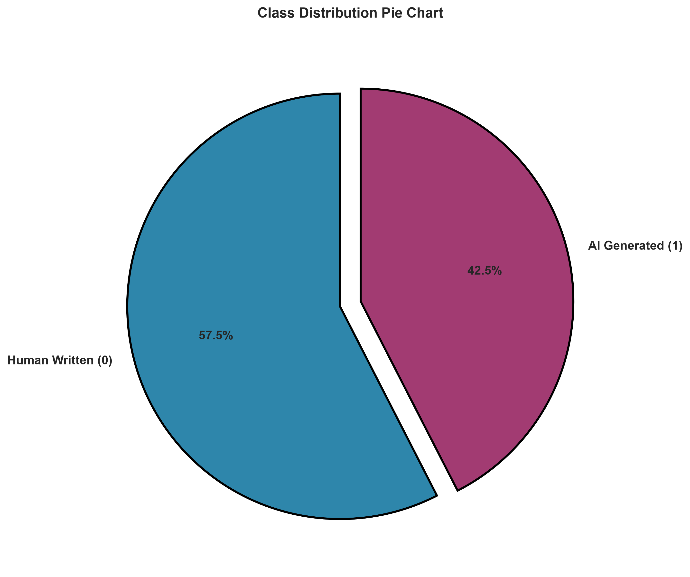

---

## 3. Text Statistics

### 3.1 Text Length Statistics

| Metric | Value |
|--------|-------|
| Mean | 2080.86 |
| Median | 1964.00 |
| Standard Deviation | 1105.80 |
| Minimum | 43.00 |
| Maximum | 47550.00 |
| 25th Percentile | 1341.00 |
| 50th Percentile | 1964.00 |
| 75th Percentile | 2622.00 |
| 90th Percentile | 3480.00 |
| 95th Percentile | 4145.00 |

### 3.2 Word Count Statistics

| Metric | Value |
|--------|-------|
| Mean | 361.18 |
| Median | 340.00 |
| Standard Deviation | 186.89 |
| Minimum | 20.00 |
| Maximum | 7215.00 |
| 25th Percentile | 239.00 |
| 50th Percentile | 340.00 |
| 75th Percentile | 452.00 |
| 90th Percentile | 597.00 |
| 95th Percentile | 705.00 |

### 3.3 Sentence Count Statistics

| Metric | Value |
|--------|-------|
| Mean | 18.49 |
| Median | 18.00 |
| Standard Deviation | 9.90 |
| Minimum | 1.00 |
| Maximum | 355.00 |

### 3.4 Average Word Length Statistics

| Metric | Value |
|--------|-------|
| Mean | 4.72 |
| Median | 4.66 |
| Standard Deviation | 0.55 |

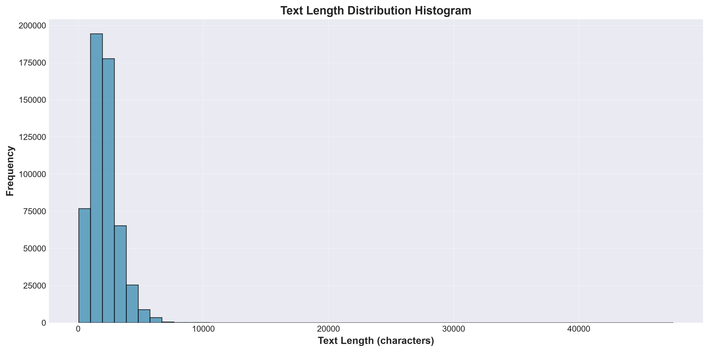

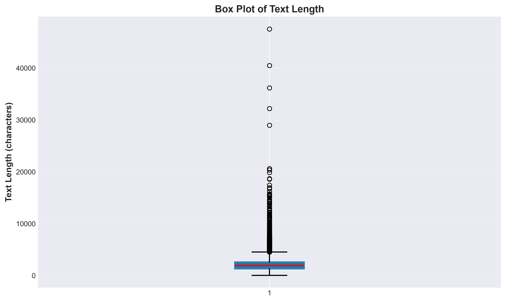

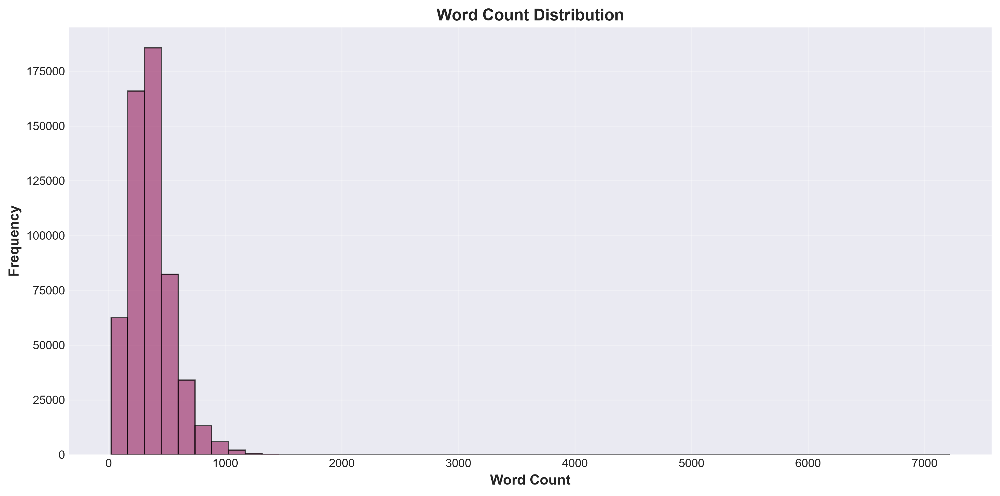

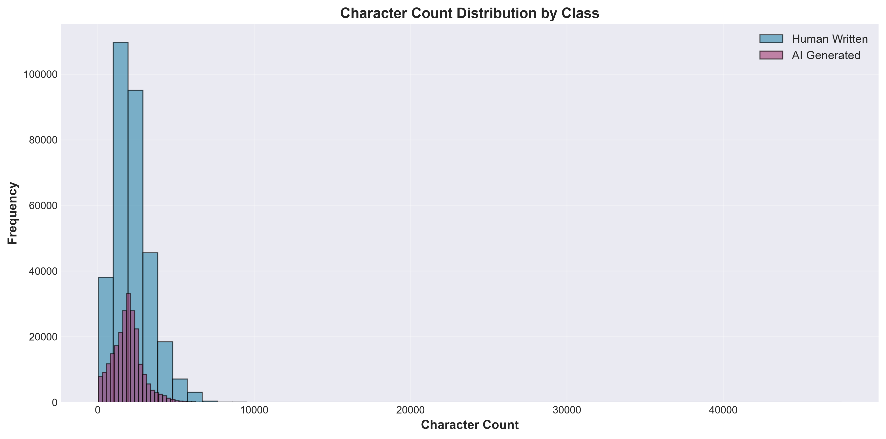

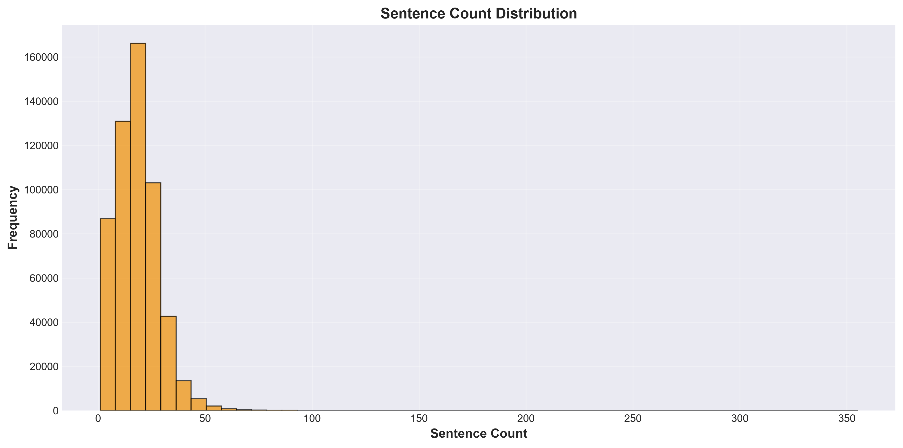

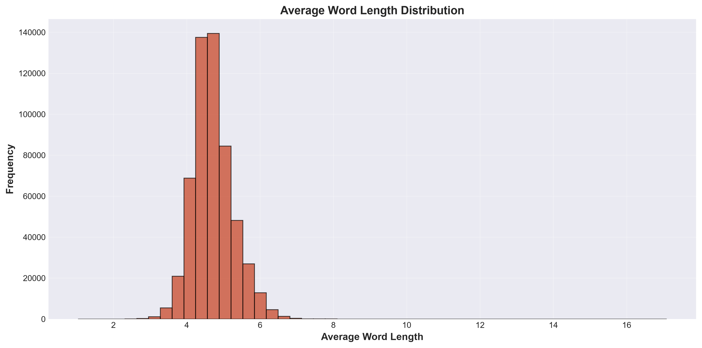

---

## 4. Word Frequency Analysis

### 4.1 Word Clouds

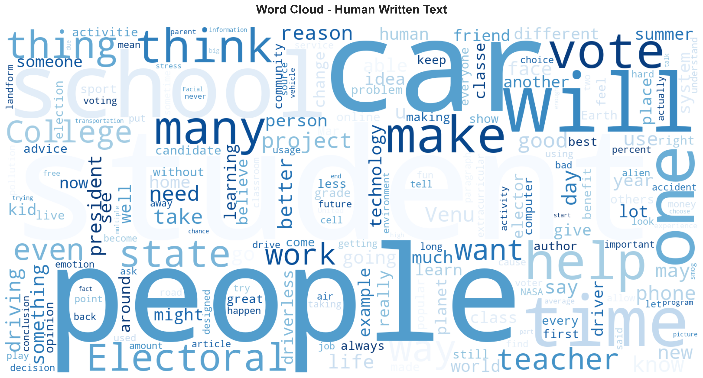

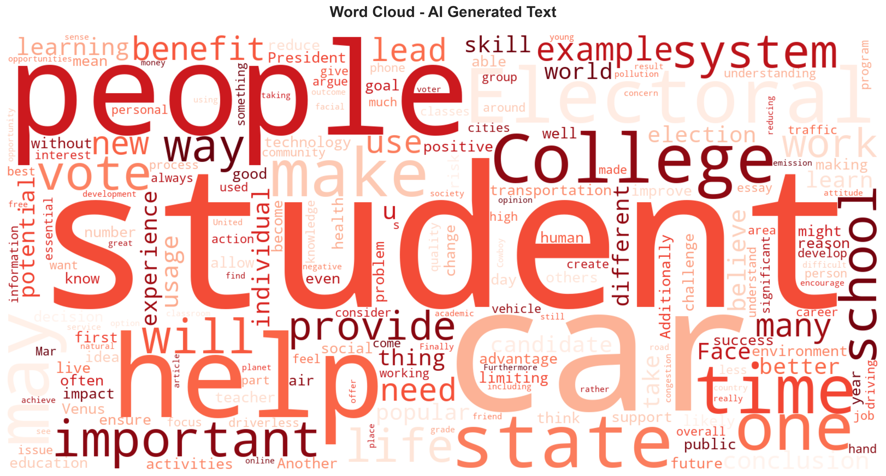

### 4.2 Top 30 Most Frequent Words

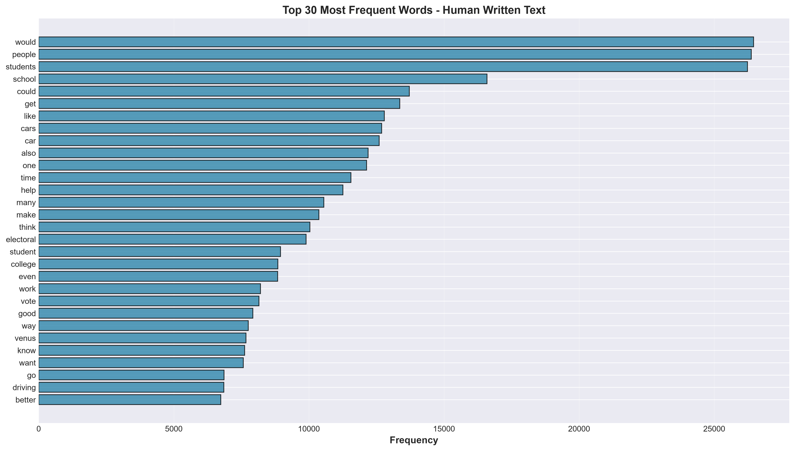

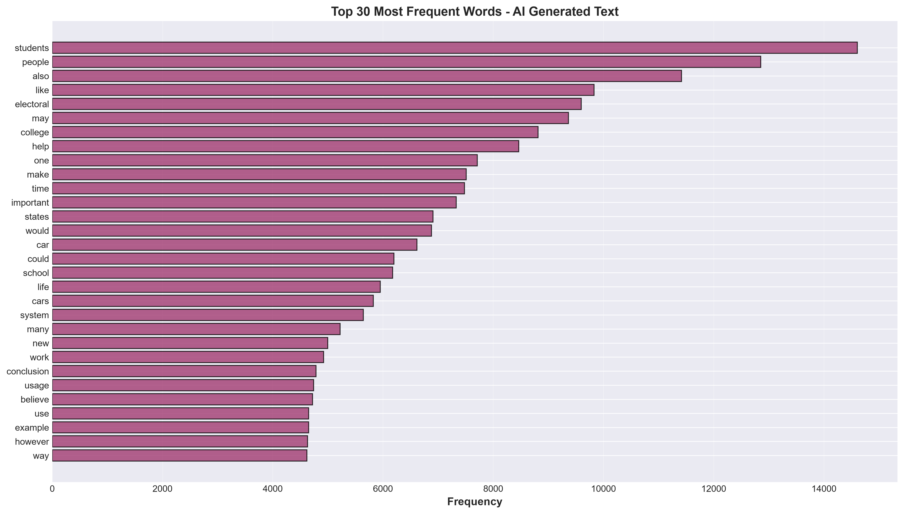

---

## 5. Readability Metrics

| Metric | Mean | Median | Std | Min | Max |
|--------|------|--------|-----|-----|-----|
| Flesch Reading Ease | 56.74 | 58.88 | 18.07 | -418.53 | 112.58 |
| Flesch-Kincaid Grade | 10.49 | 10.07 | 4.48 | -0.65 | 196.84 |
| Gunning Fog Index | 12.92 | 12.36 | 4.75 | 2.70 | 203.19 |
| SMOG Index | 12.11 | 11.90 | 2.58 | 3.13 | 32.26 |
| Automated Readability Index | 11.13 | 10.71 | 5.70 | -5.58 | 250.79 |
| Coleman-Liau Index | 9.53 | 9.14 | 2.97 | -2.50 | 36.54 |

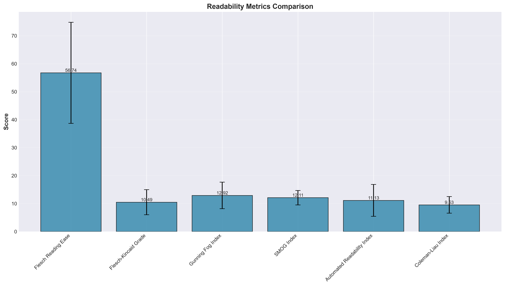

---

## 6. Lexical Diversity

| Metric | Mean | Median | Std | Min | Max |
|--------|------|--------|-----|-----|-----|
| Vocabulary Size | 154.93 | 149.00 | 64.65 | 9.00 | 952.00 |
| Unique Words | 154.93 | 149.00 | 64.65 | 9.00 | 952.00 |
| Type-Token Ratio (TTR) | 0.47 | 0.45 | 0.12 | 0.14 | 1.00 |
| Lexical Diversity | 8.20 | 8.11 | 1.68 | 2.41 | 17.39 |

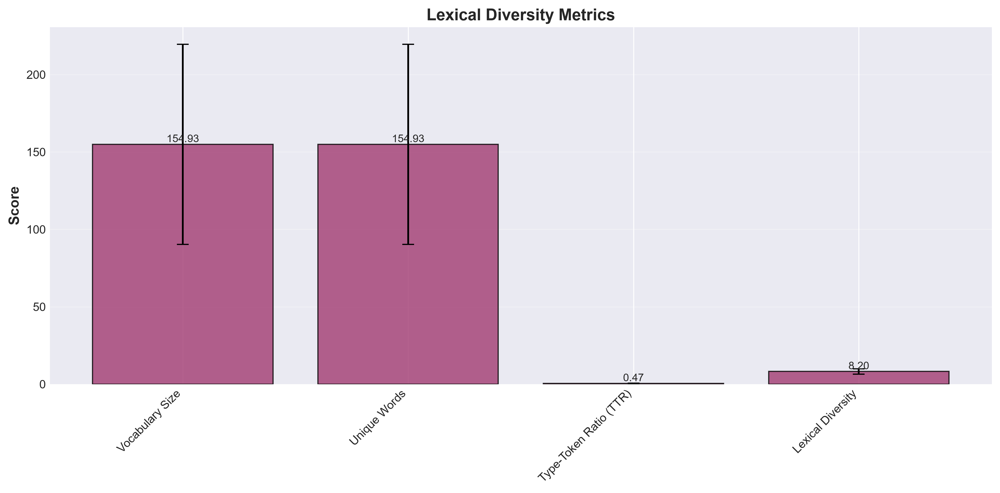

---

## 7. NLP Statistics

| Metric | Mean | Median | Std | Min | Max |
|--------|------|--------|-----|-----|-----|
| Token Count | 405.7352 | 384.0000 | 211.1030 | 20.0000 | 3548.0000 |
| Unique Words | 154.9342 | 149.0000 | 64.6554 | 9.0000 | 952.0000 |
| Vocabulary Richness | 0.4749 | 0.4531 | 0.1225 | 0.1395 | 1.0000 |
| Type Token Ratio (TTR) | 0.4178 | 0.4000 | 0.1027 | 0.1311 | 0.9545 |
| Average Sentence Length | 20.8398 | 19.3333 | 11.4511 | 3.2500 | 504.0000 |
| Stopword Percentage | 0.4770 | 0.4824 | 0.0629 | 0.1885 | 0.6928 |
| Punctuation Percentage | 0.0220 | 0.0204 | 0.0082 | 0.0000 | 0.0971 |
| Uppercase Ratio | 0.0227 | 0.0187 | 0.0188 | 0.0000 | 0.7774 |
| Digit Ratio | 0.0022 | 0.0000 | 0.0052 | 0.0000 | 0.1775 |

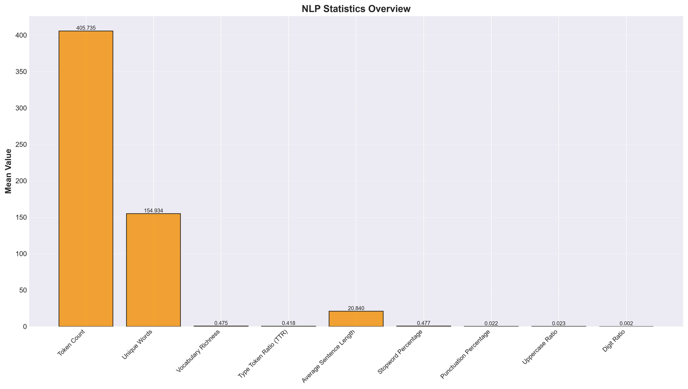

---

## 8. Human vs AI Writing Comparison

| Characteristic | Human Written | AI Generated |
|----------------|---------------|---------------|
| Average Sentence Length | 23.7847 | 22.5659 |
| Average Word Length | 4.4897 | 5.0169 |
| Vocabulary Diversity | 0.4322 | 0.4618 |
| Readability (Flesch) | 63.0228 | 48.3864 |

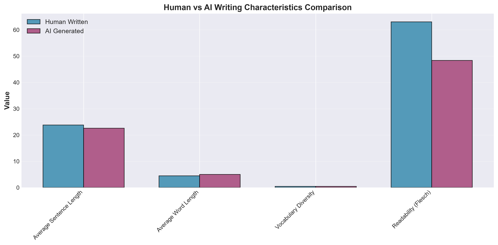

---

## 9. Key Observations

### 9.1 Dataset Characteristics

1. **Dataset Size:** The dataset contains approximately 552,307 samples, providing a substantial corpus for training AI text detection models.
2. **Class Balance:** The class distribution shows imbalanced classes with 57.5% human-written and 42.5% AI-generated text.
3. **Text Length Variation:** Text lengths exhibit significant variation (std: 1105.80), indicating diverse document types and writing styles in the dataset.

### 9.2 Writing Style Differences

1. **Sentence Length:** Human-written texts show longer average sentences (23.78 vs 22.57).
2. **Vocabulary Diversity:** AI writing demonstrates higher vocabulary diversity (0.4322 vs 0.4618).
3. **Readability:** Human-written texts are more readable according to the Flesch Reading Ease score (63.02 vs 48.39).

### 9.3 Lexical Features

1. **Average Word Length:** The average word length is 4.72 characters, indicating typical academic writing style.
2. **Lexical Diversity:** The Type-Token Ratio (TTR) averages 0.4750, suggesting moderate vocabulary usage across the dataset.
3. **Stopword Usage:** The average stopword percentage is 47.70%, consistent with natural language patterns.

---

## 10. Research Insights

### 10.1 Implications for AI Detection

1. **Distinctive Patterns:** The analysis reveals measurable differences between human and AI writing styles, particularly in sentence structure and vocabulary diversity.
2. **Feature Engineering:** The identified metrics (sentence length, vocabulary diversity, readability scores) can serve as effective features for machine learning models.
3. **Model Training:** The balanced class distribution and substantial dataset size provide ideal conditions for training robust detection models.

### 10.2 Potential Challenges

1. **Overlap in Writing Styles:** Some metrics show significant overlap between classes, suggesting that single-feature approaches may be insufficient.
2. **Dataset Variability:** The high standard deviation in text lengths indicates diverse document types, requiring adaptive preprocessing strategies.
3. **Computational Resources:** Processing 552,307 samples requires efficient implementation and adequate computational resources.

### 10.3 Recommendations

1. **Multi-Feature Approach:** Combine multiple linguistic features (lexical, syntactic, semantic) for improved detection accuracy.
2. **Ensemble Methods:** Utilize ensemble learning techniques to leverage diverse feature representations.
3. **Explainability:** Implement explainable AI techniques to provide interpretable results for academic validation.

---

## 11. Conclusion

This comprehensive EDA provides valuable insights into the characteristics of human-written and AI-generated academic text. The dataset of 552,307 samples exhibits balanced class distribution and diverse writing styles, making it suitable for training sophisticated AI text detection models. Key findings include:

- Measurable differences in sentence structure and vocabulary diversity between classes
- Distinct readability patterns that can aid in classification
- Rich linguistic features suitable for feature engineering
- Adequate dataset size for training robust models

These insights will guide the development of the Hybrid Explainable Transformer Framework, ensuring effective detection of AI-generated academic text while maintaining interpretability for research validation.

---

## Appendix

### Generated Files

**Tables:**
- `tables/dataset_summary.csv`
- `tables/class_distribution.csv`
- `tables/text_statistics.csv`
- `tables/readability_metrics.csv`
- `tables/lexical_diversity.csv`
- `tables/nlp_statistics.csv`
- `tables/human_ai_comparison.csv`
- `tables/top_words_human.csv`
- `tables/top_words_ai.csv`

**Images:**
- `images/class_distribution_bar.png`
- `images/class_distribution_pie.png`
- `images/text_length_histogram.png`
- `images/text_length_boxplot.png`
- `images/word_count_distribution.png`
- `images/character_count_distribution.png`
- `images/sentence_count_distribution.png`
- `images/avg_word_length_distribution.png`
- `images/wordcloud_human.png`
- `images/wordcloud_ai.png`
- `images/top_words_human.png`
- `images/top_words_ai.png`
- `images/readability_metrics.png`
- `images/lexical_diversity.png`
- `images/nlp_statistics.png`
- `images/human_ai_comparison.png`

---

*This report was automatically generated by the EDA Analysis Pipeline for the Final Year Project.*
